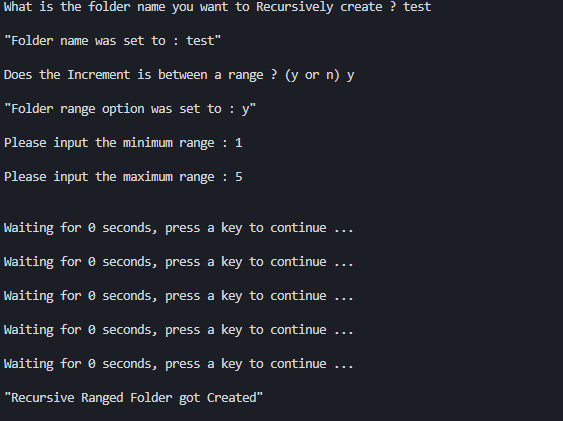
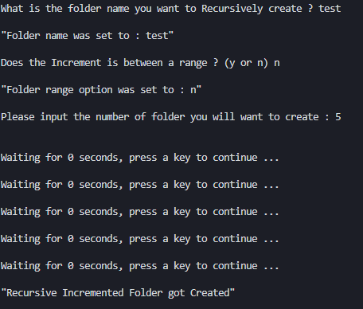

# Recursive Folder Creator

### Why creating this little script ?
I wanted a tool for me to be able to create quickly incremented folder but at the same time not wanting to always change the options directly in the batch window script.

So i decided to make it more or less interactible with a bit of options, this is my first batch script so i hope you don't mind the little code mess but it does work properly.

#### Exemple of Creating Folder betwen a user defined range
---

#### Exemple of Creating Folder betwen 1 until the maximum the user decided
---
